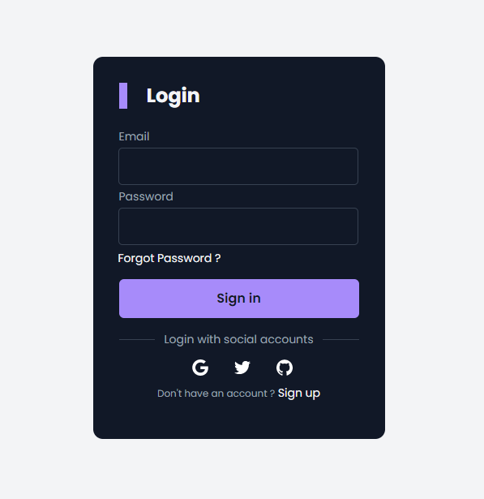

# react-firebase-authentication

React Authentication With Firebase And Routing

---- 

<pre>Put your credentials to <code>
.env
</code>.</pre>

----

<pre>Run<code>pnpm dev</code>to start application.</pre>

----

### Preview

    

----

Give a :star: if you liked it. 
Made with :heart: and react JS.

